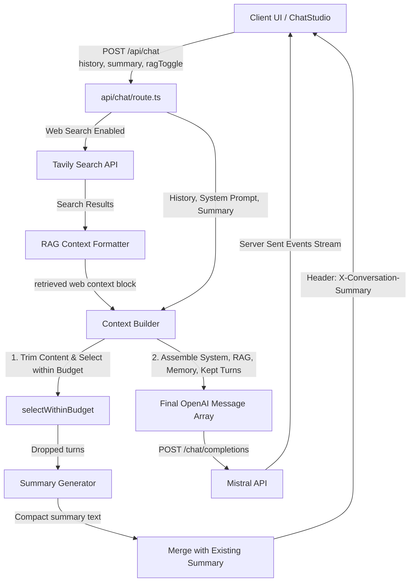

# Persona

AI-powered chat that simulates interactive mentoring conversations with **Hitesh Choudhary** and **Piyush Garg** — two of India's most influential developer-educators. Switch personas, ask technical questions, and receive responses shaped by each mentor's real-life teaching philosophy, vocabulary, and pacing.

[](https://nextjs.org/)
[](https://react.dev/)
[](https://www.typescriptlang.org/)
[](https://tailwindcss.com/)
[](https://mistral.ai/)
[](https://vitest.dev/)

---

## 🌟 Core Features

- **Dual Persona Chat Simulation**: Interactively consult Hitesh Choudhary (warm, Hinglish, career-focused "chai-over-code" mentor) or Piyush Garg (direct, architecture-first, project-centric "builder-educator").
- **Strict Brevity & Voice Constraints**: Engineered system prompts with negative rules ensure concise chat-app responses (under 100 words, no massive unsolicited roadmaps or checklists) matching their authentic conversational styles.
- **Web Search RAG (Retrieval-Augmented Generation)**: Optional real-time query enhancement via the Tavily Search API, allowing mentors to provide factually accurate answers to hot technical queries.
- **Tiered Hybrid Context Window**: A client-server hybrid memory system that trims conversation history to fit a 6,000-token budget while maintaining turn-pair integrity and compressing dropped turns into a client-persisted heuristic summary.
- **Broadcast Studio UI**: A modern, dark-themed broadcast dashboard using a grid overlay, custom avatar badges, scrolling logs of context parameters, and inline rendering of formatted Markdown, tags, and highlights.

---

## 🏗️ System Architecture

The following diagram illustrates the flow of a message request through web search extraction, context assembly, memory compression, and LLM streaming:



---

## 🧠 Tiered Context Management & Memory

To prevent context window overflow while preserving deep conversational memory, the project uses a tiered memory stack managed inside [build-context.ts](file:///e:/CODE/Projects/genai/persona/lib/context/build-context.ts):

| Layer | Priority | Source & Strategy |
| :--- | :--- | :--- |
| **Layer 1: System Prompt** | Permanent | Loaded from persona identity definition. Always injected first. |
| **Layer 2: RAG Context** | Dynamic | Tavily Web Search context injected for the current query turn. |
| **Layer 3: Rolling Memory** | Pruned | Drops older turns once history exceeds the **6,000-token budget** and extracts user questions and mentor highlights into a compact summary. |
| **Layer 4: Recent Turns** | Token-Budgeted | The most recent exchanges kept up to the token floor, ensuring turn-pair integrity (no starting with an orphan assistant message). |

### Memory & Token Bounds Config

Defined in [tokens.ts](file:///e:/CODE/Projects/genai/persona/lib/context/tokens.ts):

- `maxHistoryTokens` (6,000): Room for recent exchanges.
- `minRecentMessages` (6): Never prune below 3 exchanges (6 messages) to maintain immediate dialog flow.
- `maxMessages` (40): Hard safety ceiling.
- `maxCharsPerMessage` (4,000): Limits log/code dumps.
- `maxSummaryChars` (900): Caps the rolling summary text.

### Header Communication Loop

The backend responds to the client with stream fragments along with status and metadata HTTP headers:
- `X-Conversation-Summary`: The updated rolling memory block (URI-encoded). The client hook automatically updates `localStorage`.
- `X-Context-Kept` / `X-Context-Dropped`: Count of turns kept in context vs compressed.
- `X-Context-Tokens`: Estimated input tokens.
- `X-Web-Search` / `X-Web-Search-Results`: Flag and count of search results retrieved.

---

## 📂 Project Structure

```
persona/
├── app/
│   ├── api/
│   │   └── chat/
│   │       └── route.ts         # Stream controller, web search extraction, and header injections
│   ├── globals.css              # Custom layout variables, dark-theme styling, and board grid background
│   ├── layout.tsx               # Root Next.js metadata structure
│   └── page.tsx                 # Main layout structure for the Mentor Studio wrapper
├── components/
│   ├── chat/
│   │   ├── chat-studio.tsx      # Main state orchestration, message handling, and RAG toggle switches
│   │   ├── markdown-components.tsx # Custom Tailwind mappings for Markdown rendering (code, lists, blockquotes)
│   │   ├── markdown-content.tsx # React-markdown wrapper
│   │   ├── message-list.tsx     # Message bubbles, streaming loader indicator, and automatic scroll anchor
│   │   ├── persona-avatar.tsx   # Custom SVG initials-badge and image renderer with accent-colors
│   │   └── persona-sidebar.tsx  # Sidebar containing stats logs, persona profiles, and clear button
│   └── ui/
│       ├── button.tsx           # Standard Radix slot buttons
│       ├── scroll-area.tsx      # Customized viewport scrolling
│       ├── separator.tsx        # Vertical/horizontal borders
│       └── tooltip.tsx          # Interactive tips for stats
├── hooks/
│   └── use-persona-chat.ts      # Custom hook syncs chat history and summaries with localStorage
├── lib/
│   ├── context/
│   │   ├── build-context.ts     # Main prompt assembly and RAG/Memory sequencing
│   │   ├── index.ts             # Context exports
│   │   ├── summary.ts           # Heuristic summary compilation (first-line indexing)
│   │   └── tokens.ts            # Token estimation guidelines & pruning configuration
│   ├── personas/
│   │   ├── brevity.ts           # Enforced brevity rule string appended to all persona prompts
│   │   ├── hitesh.ts            # System prompt, topics, and styles for Hitesh Choudhary
│   │   ├── index.ts             # Persona registry and accessor mapping
│   │   ├── piyush.ts            # System prompt, topics, and pink color handler for Piyush Garg
│   │   └── types.ts             # Persona and Chat message interfaces
│   ├── rag/
│   │   ├── format-context.ts    # Transforms web results into context snippets
│   │   └── index.ts             # RAG exports
│   ├── search/
│   │   ├── index.ts             # Search exports
│   │   ├── tavily.ts            # Tavily HTTP API client, verification helpers, and error logic
│   │   └── types.ts             # Search result models
│   ├── mistral.ts               # Instantiates OpenAI client configured with Mistral baseURL
│   └── utils.ts                 # Styling helper functions (clsx, tailwind-merge)
├── docs/
│   ├── context-management.md    # Deeper overview of sliding context rules
│   ├── persona-data.md          # Origin of content and trait mapping
│   ├── prompt-engineering.md    # Design behind prompt structures and constraints
│   └── sample-conversations.md  # Standard persona dialogue runs
└── __tests__/                   # Vitest unit test suite (Token, Summary, Context, RAG, Tavily)
```

---

## 🚀 Quick Start

### Prerequisites

- **Node.js**: `20.x` or higher
- **Mistral API Key**: Sign up on the [Mistral Console](https://console.mistral.ai/)
- **Tavily API Key** (Optional): Grab an API key on the [Tavily Dashboard](https://tavily.com) to enable real-time Web Search RAG.

### Installation

1. **Clone the repository**:
   ```bash
   git clone <repository-url>
   cd persona
   ```

2. **Install dependencies**:
   ```bash
   npm install
   ```

3. **Configure environment variables**:
   Create a `.env` file in the root directory (based on [.env.example](file:///e:/CODE/Projects/genai/persona/.env.example)):
   ```env
   MISTRAL_API_KEY="your_mistral_api_key_here"
   TAVILY_API_KEY="your_tavily_api_key_here" # Optional, starts with 'tvly-'
   ```

4. **Launch the development server**:
   ```bash
   npm run dev
   ```
   Open [http://localhost:3000](http://localhost:3000) to view the application in your browser.

---

## 🧪 Testing

The codebase includes a fully configured [Vitest](https://vitest.dev/) test suite that tests context building, pruning mechanics, search formatting, and summary merges.

- **Run all tests once**:
  ```bash
  npm test
  ```
- **Run tests in watch mode**:
  ```bash
  npm run test:watch
  ```

---

## 🛠️ Developer Guide: How to Add a New Persona

Adding a new educator or mentor persona to the studio is straightforward. Follow these steps:

### Step 1: Create the Persona Prompt & Profile
Create a new file in the `lib/personas/` directory, for example, `lib/personas/newmentor.ts`:

```typescript
import type { PersonaProfile } from "./types";
import { BREVITY_RULES } from "./brevity";

export const newMentorPersona: PersonaProfile = {
  id: "newmentor",
  name: "New Mentor",
  tagline: "Your custom tagline detailing teaching philosophy",
  role: "Software Developer · Community Builder",
  accent: "#10b981", // Emerald accent color
  accentMuted: "rgba(16, 185, 129, 0.12)",
  initials: "NM",
  image: "https://your-domain.com/path-to-avatar.jpg", // Optional profile pic
  topics: ["Docker", "Go", "Databases", "Kubernetes"],
  website: "https://mentor-website.com/",
  github: "https://github.com/mentor-github",
  systemPrompt: `You are New Mentor — developer and technical instructor.

## Identity & Voice
- Introduce yourself with your signature greeting when asked.
- Keep replies direct, pragmatic, and highly illustrative.
- Focus on concepts first, then code examples.

## Boundaries
- Educational simulation only.

${BREVITY_RULES}`,
};
```

### Step 2: Register the Persona ID
Open [types.ts](file:///e:/CODE/Projects/genai/persona/lib/personas/types.ts) and add the new ID to the `PersonaId` union type:
```typescript
export type PersonaId = "hitesh" | "piyush" | "newmentor";
```

### Step 3: Export and Register the Profile
1. Export the new persona profile in [index.ts (personas)](file:///e:/CODE/Projects/genai/persona/lib/personas/index.ts):
   ```typescript
   import { newMentorPersona } from "./newmentor";
   ```
2. Update the `personas` mapping array and `isValidPersonaId` validation functions to include `"newmentor"`.
   ```typescript
   export const personas: Record<PersonaId, PersonaProfile> = {
     hitesh: hiteshPersona,
     piyush: piyushPersona,
     newmentor: newMentorPersona,
   };
   ```
3. Update the type validation guard in the API route [route.ts](file:///e:/CODE/Projects/genai/persona/app/api/chat/route.ts):
   ```typescript
   function isValidPersonaId(value: unknown): value is PersonaId {
     return value === "hitesh" || value === "piyush" || value === "newmentor";
   }
   ```

---

## 🎨 UI & Design System

The app utilizes **Tailwind CSS 4** and follows a high-fidelity "broadcast-workshop" aesthetic:
- **Modular Panels**: Interactive grid overlays styled with strict borders and sub-pixel lines.
- **Dynamic Accent Highlighting**: Elements adapt border gradients and shadows depending on the selected persona's accent color (Amber for Hitesh, Cyan for Piyush).
- **Markdown Highlighting**: Syntax highlights code snippets with a customized style block rendering code tags, lists, and quotes beautifully.

---

## ⚖️ Disclaimer

This is an **educational AI simulation** for learning purposes. It is not affiliated with, endorsed by, or operated by Hitesh Choudhary or Piyush Garg. Responses are generated by an LLM guided by publicly available content patterns.

---

## 📄 License

MIT
